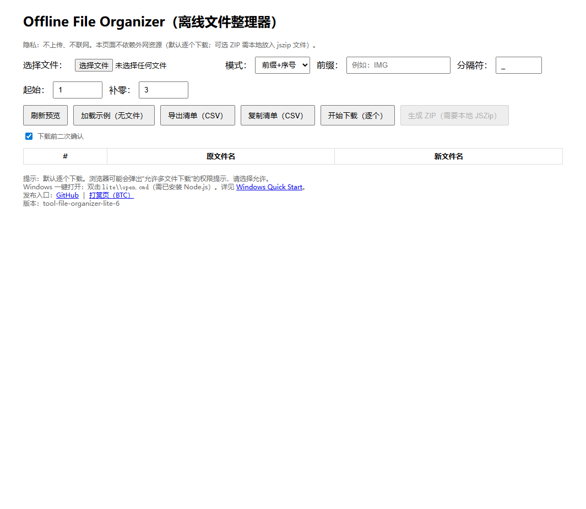

# Offline File Organizer (Lite) — One-pager (EN)

Short version (EN, 100–200 words): `docs/marketplace/one-pager-short_EN.md`

**What it is**
- A tiny, fully-offline web tool to help people quickly organize local files into a clean structure.
- No backend. No account. Works even when internet is blocked.

**Best for**
- Freelancers / virtual assistants dealing with messy downloads
- Windows users who prefer double-click workflows
- Anyone who needs a quick file inventory (CSV) before organizing

**Key features (Lite)**
- Fully offline (single HTML file)
- Generate a file list CSV (for review / client approval)
- Optional “apply plan” mode with confirmation
- One-click open on Windows: `lite\\open.cmd`

**Quick start (Windows)**
1) Download the repo (or just the `lite/` folder)
2) Double-click: `lite\\open.cmd`
3) Read: `docs/windows-quickstart.md`

**Try it**
- GitHub repo: https://github.com/peng1233/offline-file-organizer
- Lite tool entry: https://peng1233.github.io/offline-file-organizer/ (click **Lite**)

**Screenshot**

**Support / tip jar**
- BTC tip page: https://peng1233.github.io/btc-receive/
- GitHub Sponsors: https://github.com/sponsors/peng1233

**Notes (for clients/platforms)**
- The Lite version is designed to be usable in restricted environments.
- If the full version can’t load external libraries (e.g., JSZip), Lite still works.
