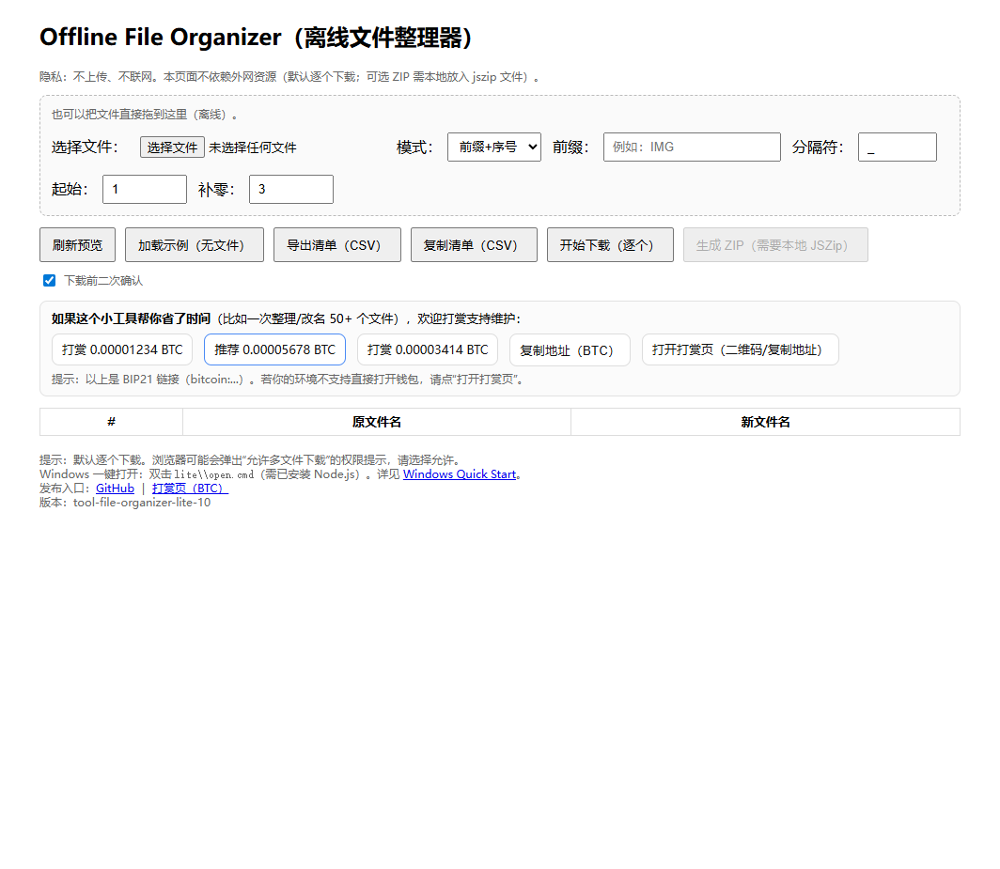

# Windows Quickstart (local run)

> Why local?
> - The browser can only select folders/files using the File System Access API in a **secure context**.
> - So you should open the app via **http://localhost**, not by double-clicking a `file://` HTML file.

## Option A (fast): Lite page only (no Node.js required)

If you only want to preview the Lite UI quickly:

- Double-click: `lite\open.cmd`

Notes:
- When opened via `file://`, some browsers may restrict folder/file picking.
- If you need the full workflow (pick folder / generate CSV / download), use Option B.

Screenshot (Lite UI):



## Option B (recommended): One-command local server (requires Node.js)

### Prerequisite

- Install **Node.js LTS**

### Start server

Open PowerShell in the repo root, then run:

```powershell
powershell -ExecutionPolicy Bypass -File tools\serve.ps1
```

URLs:
- Main: http://127.0.0.1:5173/
- Lite: http://127.0.0.1:5173/lite/

### Custom port / no auto-open

```powershell
powershell -ExecutionPolicy Bypass -File tools\serve.ps1 -Port 5173 -NoOpen
```

## Troubleshooting

- PowerShell script execution policy blocked
  - The command above already uses `-ExecutionPolicy Bypass` (process-only).
  - Or set it for the current PowerShell process:

```powershell
Set-ExecutionPolicy -Scope Process -ExecutionPolicy Bypass
```

- Port 5173 is in use

```powershell
powershell -ExecutionPolicy Bypass -File tools\serve.ps1 -Port 5174
```

## Stop

Press `Ctrl + C` in the server terminal.
